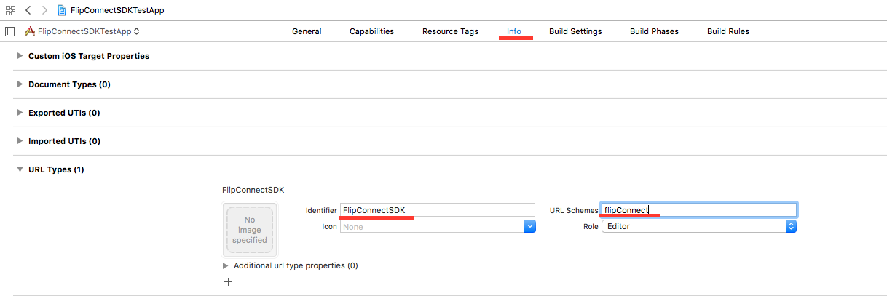
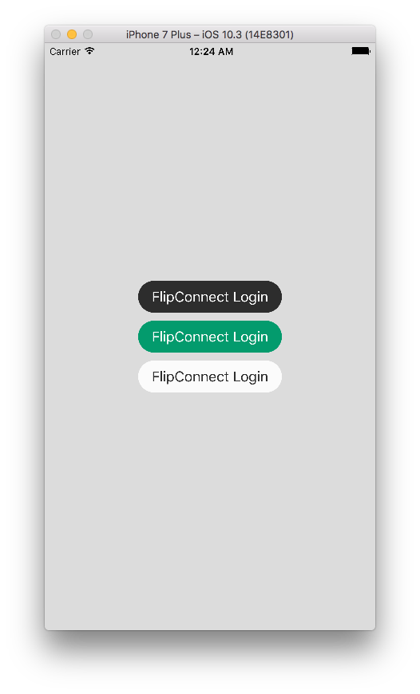

# FlipConnectSDK

[](https://www.bitrise.io/app/e2ffa72d64f58e17) [](https://codecov.io/gh/Flip-Payments/connect-sdk-ios) [](https://raw.githubusercontent.com/Flip-Payments/connect-sdk-ios/master/LICENSE) [](https://github.com/Flip-Payments/connect-sdk-ios/releases) [](https://github.com/Carthage/Carthage) [](http://cocoadocs.org/docsets/FlipConnectSDK/) 

You can see more here: [FlipConnectSDK Reference](http://cocoadocs.org/docsets/FlipConnectSDK/)

## How It Works

The FlipConnectSDK works by receiving **ClientId** and **ClientSecret** to open a Web Page to login just like Facebook and Google authentication does, the user will login in our ambient and if it is successful the user will be redirected to the application using the previously configured **RedirectURI**.

When the application opens, the SDK will search for valid parameters on the URI so it can made requests to rescue the access token, refresh token and account key.

With those informations you're now able to access the user data!

## Installation

### Carthage

Place this on your Cartfile:

```yaml
github "Flip-Payments/connect-sdk-ios" ~> 0.0.4
```

and then run:

```sh
carthage update
```

### Cocoapods

Add to your `Podfile`

```ruby
target 'MyApplication' do
  use_frameworks!
  pod 'FlipConnectSDK', '~> 0.0.4'
end
```

## Usability

### Configuration

On your project, click on 'Info' tab and select Url Types. On `identifier` field it's mandatory that the name is **FlipConnectSDK** and on URL Schemes you must put the scheme that was set for your Merchant URI, for example:

If the registered Merchant URI is `flipConnect://application` your Url Schemes must be **flipConnect**, in other words everything **before** `://` is your Url Scheme.



On your `Info.plist` you must add your **ClientID**, **ClientSecret**, **PublicTokenAPI** and **RedirectURI** registered on our API, it'll be used by the SDK to handle redirect from our login page:

```xml
<key>FlipConnectSDK</key>
<dict>
  <key>RedirectURI</key>
  <string>flipConnect://application</string>
  <key>ClientSecret</key>
  <string>FD5A0D34-878D-483B-9CC0-573DFB82A75B</string>
  <key>ClientID</key>
  <string>D7F667C8-199F-6B10-B53A-0BCDDEFADB31</string>
  <key>PublicTokenAPI</key>
  <string>5FFZ67B941DAACCDCB1888CDC97FA8F7</string>
</dict>
```
The final result will be something like this:

```xml
<?xml version="1.0" encoding="UTF-8"?>
<!DOCTYPE plist PUBLIC "-//Apple//DTD PLIST 1.0//EN" "http://www.apple.com/DTDs/PropertyList-1.0.dtd">
<plist version="1.0">
<dict>
	<key>CFBundleDevelopmentRegion</key>
	<string>en</string>
	<key>CFBundleExecutable</key>
	<string>$(EXECUTABLE_NAME)</string>
	<key>CFBundleIdentifier</key>
	<string>$(PRODUCT_BUNDLE_IDENTIFIER)</string>
	<key>CFBundleInfoDictionaryVersion</key>
	<string>6.0</string>
	<key>CFBundleName</key>
	<string>$(PRODUCT_NAME)</string>
	<key>CFBundlePackageType</key>
	<string>APPL</string>
	<key>CFBundleShortVersionString</key>
	<string>1.0</string>
	<key>CFBundleURLTypes</key>
	<array>
		<dict>
			<key>CFBundleTypeRole</key>
			<string>Editor</string>
			<key>CFBundleURLName</key>
			<string>FlipConnectSDK</string>
			<key>CFBundleURLSchemes</key>
			<array>
				<string>flipConnect</string>
			</array>
		</dict>
	</array>
	<key>CFBundleVersion</key>
	<string>1</string>
	<key>FlipConnectSDK</key>
	<dict>
	<key>RedirectURI</key>
	<string>flipConnect://application</string>
	<key>ClientSecret</key>
	<string>FD5A0D34-878D-483B-9CC0-573DFB82A75B</string>
	<key>ClientID</key>
	<string>D7F667C8-199F-6B10-B53A-0BCDDEFADB31</string>
	<key>PublicTokenAPI</key>
	<string>5FFZ67B941DAACCDCB1888CDC97FA8F7</string>
	</dict>
	<key>LSRequiresIPhoneOS</key>
	<true/>
	<key>UILaunchStoryboardName</key>
	<string>LaunchScreen</string>
	<key>UIMainStoryboardFile</key>
	<string>Main</string>
	<key>UIRequiredDeviceCapabilities</key>
	<array>
		<string>armv7</string>
	</array>
	<key>UISupportedInterfaceOrientations</key>
	<array>
		<string>UIInterfaceOrientationPortrait</string>
		<string>UIInterfaceOrientationLandscapeLeft</string>
		<string>UIInterfaceOrientationLandscapeRight</string>
	</array>
	<key>UISupportedInterfaceOrientations~ipad</key>
	<array>
		<string>UIInterfaceOrientationPortrait</string>
		<string>UIInterfaceOrientationPortraitUpsideDown</string>
		<string>UIInterfaceOrientationLandscapeLeft</string>
		<string>UIInterfaceOrientationLandscapeRight</string>
	</array>
	<key>NSAppTransportSecurity</key>
	<dict>
		<key>NSAllowsArbitraryLoads</key>
		<true/>
	</dict>
</dict>
</plist>

```
### ViewController

Login will start here, some action will trigger the login page, if everything works fine the web page will redirect back to the application.

You can use your own button or use ours.

On your ViewController import the SDK:

```swift
import FlipConnectSDK
```

### Login With Button

```swift
class ViewController: UIViewController {

    var flipLogin: FCLogin!

    override func viewDidLoad() {
        super.viewDidLoad()

        do {
            flipLogin = try FCLogin.shared()

            let loginBtn = flipLogin.loginWithButton(center: view.center, frame: CGRect(x: 0, y: 0, width: 180, height: 40), color: .darkGray, title: "FlipConnect Login")
            view.addSubview(loginBtn)

        } catch {
            print(error)
        }
    }
}
```
The button will look like one of these:



### Login with openLoginURL

```swift
class ViewController: UIViewController {

    var flipLogin: FCLogin!

    override func viewDidLoad() {
        super.viewDidLoad()

        do {
            flipLogin = try FCLogin.shared()
        } catch {
            print(error)
        }
    }

    @IBAction func printCookies(_ sender: UIButton) {
        self.flipLogin.loginButtonClicked()
    }
}
```

### AppDelegate

With successful login the redirect will pass through here with some login information, but only after the `handleRedirect(fromURL: URL)` method runs smoothly that we'll be able to recover Token Data.

```swift
class AppDelegate: UIResponder, UIApplicationDelegate {
    func application(_ app: UIApplication, open url: URL, options: [UIApplicationOpenURLOptionsKey : Any] = [:]) -> Bool {
        do {
            let loginFlip = try FCLogin.shared()
            loginFlip.handleRedirect(fromURL: url) { error in
                guard error == nil else {
                    print(error!)
                    return
                }

                // DO SOMETHING
            }
        } catch {
            print(error)
        }
        
        return true
    }
}
```

You should be able to use the Token and AccountKey by typing the following:

```swift
var accessToken: String? = UserDefaults.standard.accessToken
var accountKey: String? = UserDefaults.standard.accountKey
```

### Refresh Token

If the token gets expired, just do the following implementation. If some error return it's because the request was unsuccessful

```swift
do {
	loginFlip = try FCLogin.shared()

	loginFlip.refreshToken() { err in
		guard err == nil else {
			print("refresh with no success")
			print(err!)
			return
		}
		print("Tokens Refreshed")
		print("NewToken: \(String(describing: UserDefaults.standard.accessToken))")
		print("NewAccessKey: \(String(describing: UserDefaults.standard.accountKey))")
	}

} catch {
	print(error)
}

```

### Verify Token

If some error return it's because the token verified is invalid

```swift
do {
	loginFlip = try FCLogin.shared()

	loginFlip.verifyToken() { err in
		guard err == nil else {
			print("no success verifying")
			print(err!)
			return
		}
		print("Tokens successfully verified")
	}

} catch {
	print(error)
}
```

## Contributing

Pull Requests are very welcome!

## Issues

Any problems, questions or suggestions? [Open a issue!](https://github.com/Flip-Payments/connect-sdk-ios/issues/new)
