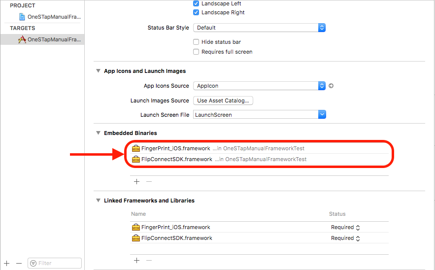
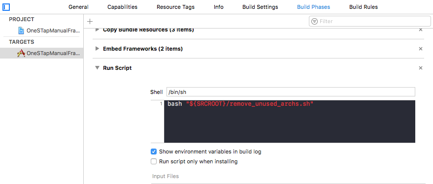
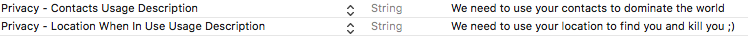

# FlipConnectSDK

[](https://www.bitrise.io/app/e2ffa72d64f58e17) [](https://codebeat.co/projects/github-com-flip-payments-connect-sdk-ios-master) [](https://raw.githubusercontent.com/Flip-Payments/connect-sdk-ios/master/LICENSE) [](https://github.com/Flip-Payments/connect-sdk-ios/releases) [](https://github.com/Carthage/Carthage) [](http://cocoadocs.org/docsets/FlipConnectSDK/) 

Veja mais aqui: [FlipConnectSDK Reference](http://cocoadocs.org/docsets/FlipConnectSDK/)

## Como funciona

A FlipConnectSDK funciona recebendo **ClientId** e **ClientSecret** para abrir uma página web para logar exatamente como na autenticação do Facebook e do Google. O usuário irá logar no nosso ambiente e, caso seja bem sucedido, o usuário será redirecionado para a aplicação usando a previamente configurada **RedirectURI**.

Quando a aplicação abre, a SDK irá procurar por parâmetros válidos na URI, para que então possa fazer requisições para recuperar o `accesToken`, o `refreshToken` e a `userKey`.

Com essas informações você será capaz de acessar as informações do usuário!

## Instalação

### Carthage

Coloque isto no seu Cartfile:

```yaml
github "Flip-Payments/connect-sdk-ios" ~> 0.4
```

e então rode o seguinte comando:

```sh
carthage update
```
**OBS:** O Carthage irá baixar dois frameworks o `FlipConnectSDK.framework` e `FingerPrint_iOS.framework`, ambos devem ser colocados no seu app para que funcione corretamente.

### Cocoapods

Acrescente ao seu  `Podfile`

```ruby
target 'MyApplication' do
  use_frameworks!
  pod 'FlipConnectSDK', '~> 0.4'
end
```

### Instalação manual

Para instalar manualmente a SDK é necessário baixar o `.zip` [FlipConnectSDK_Manual.framework.zip](https://github.com/Flip-Payments/connect-sdk-ios/releases) e colocar em **Embedded Binaries** como na imagem abaixo:



Depois é necessário baixar o script [remove_unused_archs.sh](https://raw.githubusercontent.com/Flip-Payments/connect-sdk-ios/master/scripts/remove_unused_archs.sh) e adicionar em `Build Phases > Run Script` o seguinte comando: `bash "${SRCROOT}/remove_unused_archs.sh"` (lembrando que neste caso o script está no root do projeto, se o seu script estiver em outra pasta é necessário informar o caminho desta pasta) como na imagem abaixo:



Estes passos são necessários para rodar o script manual porque ambos os frameworks contém todos as arquiteturas dentro dele, mas a loja da Apple não permite publicar o app com as arquiteturas de simulador, por isso este post script garante a remoção destas arquiteturas para que a publicação ocorra sem problemas.

## Usabilidade

### Configuração

No seu projeto, clique na aba "informação" e selecione Url Types. No campo `identifier`, é obrigatório que o nome seja **FlipConnectSDK**, e na URL Schemes você deve colocar o esquema que foi configurado para seu Merchant URI, por exemplo:

Se a Merchant URI registrada é `flipConnect://application` sua Url Schemes deve ser **flipConnect**; em outras palavras, tudo **antes de** `://` é sua Url Scheme.


### Inicialização

É necessário inicializar a classe de login na abertura do app no `AppDelegate.swift`, e colar o código abaixo. O parâmetro fingerPrintID é opcional, deve ser passado apenas se quiser utilizar o anti-fraude.

```swift
func application(_ application: UIApplication, didFinishLaunchingWithOptions launchOptions: [UIApplicationLaunchOptionsKey: Any]?) -> Bool {
        let config = FCConfiguration(
            environment: .sandbox,
            clientID: "{SEU_CLIENT_ID}",
            clientSecret: "{SEU_CLIENT_SECRET}",
            redirectURI: "{SUA_REDIRECT_URI}", // EX: flipconnect://application
            fingerPrintID: "{SEU_FINGERPRINT_ID}"
        )
        do {
            _ = try FCLogin.shared()
        } catch {
            print(error)
        }
        return true
    }
```

Após esta inicialização, se for passado o `fingerPrintID`, o `fingerPrintSessionID` será *setado* e você poderá acessá-lo chamando o `UserDefaults` como no exemplo abaixo:

```swift
if let fingerPrintSessionID = UserDefaults.standard.fingerPrintSessionID {
    print(fingerPrintSessionID)
}
```

### ViewController

O login terá início aqui. Alguma ação irá ativar a página de login; se tudo funcionar corretamente, a página web irá redirecionar de volta para a aplicação.

Você pode usar seu próprio botão ou usar o nosso.

No seu ViewController importe a SDK:

```swift
import FlipConnectSDK
```

### Logar com o botão

```swift
class ViewController: UIViewController {

    var fcLogin: FCLogin!

    override func viewDidLoad() {
        super.viewDidLoad()

        do {
            fcLogin = try FCLogin.shared()

            let loginBtn = fcLogin.loginWithButton(center: view.center, frame: CGRect(x: 0, y: 0, width: 180, height: 40), color: .darkGray, title: "FlipConnect Login")
            view.addSubview(loginBtn)

        } catch {
            print(error)
        }
    }
}
```
O botão parecerá com algum destes:


### Logar com openLoginURL

```swift
class ViewController: UIViewController {

    var fcLogin: FCLogin!

    override func viewDidLoad() {
        super.viewDidLoad()

        do {
            fcLogin = try FCLogin.shared()
        } catch {
            print(error)
        }
    }

    @IBAction func loginAction(_ sender: UIButton) {
        self.fcLogin.loginButtonClicked()
    }
}
```

### Enviando dados de FingerPrint para o anti-fraude (opcional)

Com o FingerPrintID sendo enviado na inicialização da classe `FCLogin`, enviar dados para o anti-fraude é muito simples, basta colocar permissões no seu app para o usuário liberar acesso aos contatos e o mesmo para localização.

**OBS:** Lembre-se que a Apple pode encrencar com a publicação do seu app se ele pedir permissão ao usuário de dados que são desnecessários para o app, não vale pedir acesso aos contatos do seu usuário se o seu app não faz nada com os contatos dele, não é mesmo?

Para pedir as permissões de acesso para o usuário basta acrescentar estas linhas no `Info.plist`:



### Transferência de Dados para Perfil temporário

Se desejar transferir os dados de cadastro que já tem em sua base para facilitar o cadastro e a transição do usuário para o nosso sistema, você pode usar a variável `temporaryProfile` para preencher os dados cadastrais do usuário.

Para utilizar basta atribuir um valor do tipo `TemporaryProfile` a variável `temporaryProfile` da classe `FCLogin`:

```swift
class ViewController: UIViewController {

    var fcLogin: FCLogin!

    override func viewDidLoad() {
        super.viewDidLoad()

        do {
            fcLogin = try FCLogin.shared()

	    let formatter = DateFormatter()
            formatter.dateFormat = "yyyy/MM/dd"
            let birthdate = formatter.date(from: "1997/12/17")
            
            let personalData = PersonalData(birthdate: birthdate, genderType: .masculine, country: "br", dependentCount: 3)!
            let vehicle = Vehicle(licensePlate: "LNY-4266", licensePlateCity: "Rio de Janeiro", licensePlateState: "RJ", licensePlateCountry: "br")!
            let vehicle2 = Vehicle(licensePlate: "LNY-4266", licensePlateCity: "Rio de Janeiro", licensePlateState: "RJ", licensePlateCountry: "br")!
            let document = Document(documentType: .cpf, documentNumber: "12345678901")!
            let phone = Phone(phoneType: .mobile, fullNumber: "26113328")!
            let phone2 = Phone(phoneType: .home, fullNumber: "26113328")!
            let address = Address(street: "Conde de Bonfim", number: "800", addressType: .work, city: "Rio de Janeiro", state: "RJ", country: "br")!
            let address2 = Address(street: "Conde de Bonfim", number: "800", addressType: .work, city: "Rio de Janeiro", state: "RJ", country: "br")!
            
            let temporaryProfile = TemporaryProfile()
            temporaryProfile.addresses = [address, address2]
            temporaryProfile.documents = [document]
            temporaryProfile.personalData = personalData
            temporaryProfile.phones = [phone, phone2]
            temporaryProfile.vehicles = [vehicle, vehicle2]

	    fcLogin.temporaryProfile = temporaryProfile
        } catch {
            print(error)
        }
    }

    @IBAction func loginAction(_ sender: UIButton) {
        self.fcLogin.loginButtonClicked()
    }
}
```

Ou na chamada do método `loginWithButton()`:

```swift
class ViewController: UIViewController {

    var fcLogin: FCLogin!

    override func viewDidLoad() {
        super.viewDidLoad()

        do {
            fcLogin = try FCLogin.shared()

	    let formatter = DateFormatter()
            formatter.dateFormat = "yyyy/MM/dd"
            let birthdate = formatter.date(from: "1997/12/17")
            
            let personalData = PersonalData(birthdate: birthdate, genderType: .masculine, country: "br", dependentCount: 3)!
            let vehicle = Vehicle(licensePlate: "LNY-4266", licensePlateCity: "Rio de Janeiro", licensePlateState: "RJ", licensePlateCountry: "br")!
            let vehicle2 = Vehicle(licensePlate: "LNY-4266", licensePlateCity: "Rio de Janeiro", licensePlateState: "RJ", licensePlateCountry: "br")!
            let document = Document(documentType: .cpf, documentNumber: "12345678901")!
            let phone = Phone(phoneType: .mobile, fullNumber: "26113328")!
            let phone2 = Phone(phoneType: .home, fullNumber: "26113328")!
            let address = Address(street: "Conde de Bonfim", number: "800", addressType: .work, city: "Rio de Janeiro", state: "RJ", country: "br")!
            let address2 = Address(street: "Conde de Bonfim", number: "800", addressType: .work, city: "Rio de Janeiro", state: "RJ", country: "br")!
            
            let temporaryProfile = TemporaryProfile()
            temporaryProfile.addresses = [address, address2]
            temporaryProfile.documents = [document]
            temporaryProfile.personalData = personalData
            temporaryProfile.phones = [phone, phone2]
            temporaryProfile.vehicles = [vehicle, vehicle2]

	    let btn = fcLogin.loginWithButton(center: view.center, temporaryProfile: temporaryProfile)

	    view.addSubview(btn)
        } catch {
            print(error)
        }
    }

    @IBAction func loginAction(_ sender: UIButton) {
        self.fcLogin.loginButtonClicked()
    }
}
```

Com isso a tela de cadastro irá se abrir com os dados já preenchidos no ato do cadastro do usuário.

### AppDelegate

Após um login bem sucedido, o redirecionamento passará por aqui com alguma informação de login, porém apenas depois do método `handleRedirect(fromURL: URL)` funcionar sem problemas é que nós seremos capazes de recuperar o **Token Data**.

```swift
class AppDelegate: UIResponder, UIApplicationDelegate {
    func application(_ app: UIApplication, open url: URL, options: [UIApplicationOpenURLOptionsKey : Any] = [:]) -> Bool {
        do {
            let fcLogin = try FCLogin.shared()
            fcLogin.handleRedirect(fromURL: url) { tokenResponse, error in

                guard error == nil else {
                    print(error!)
                    return
                }

                if tokenResponse.success {
                    // DO SOMETHING
                    print(tokenResponse.accessToken!)
                    print(tokenResponse.userKey!)
                    print(tokenResponse.refreshToken!)
                }
            }
        } catch {
            print(error)
        }
        
        return true
    }
}
```

Você deverá ser capaz de usar o `accessToken`, `refreshToken` e a `userKey` se digitar o seguinte:

```swift
let accessToken: String? = UserDefaults.standard.accessToken
let userKey: String? = UserDefaults.standard.userKey
let refreshToken: String? = UserDefaults.standard.refreshToken
```

### Refresh Token

Se o token expirar, basta fazer a implementação que segue. Se algum erro retornar ou o sucesso do `tokenResponse` for `false`, é porque a requisição foi mal-sucedida

```swift
do {
	let fcLogin = try FCLogin.shared()

	FCApi.requestTokenRefresh() { tokenResponse, error in
		guard error == nil else {
			print("Refresh with NO success")
			print(err!)
			return
		}

            if tokenResponse.success {
                // DO SOMETHING
                print("Tokens Refreshed")
                print(tokenResponse.accessToken!)
                print(tokenResponse.userKey!)
                print(tokenResponse.refreshToken!)
            } else {
                // ERROR HANDLING
                var message = ""
                for report in tokenResponse.operationReport {
                    message.append("\(report.field) - \(report.message)")
                }
            }
	}

} catch {
	print(error)
}

```

### Verificar o Token

Se algum erro retornar ou o sucesso do `tokenResponse` for `false`, é porque a requisição foi mal-sucedida e/ou o token verificado é inválido

```swift
do {
	let fcLogin = try FCLogin.shared()

	FCApi.requestTokenVerification() { tokenResponse, error in
            guard error == nil else {
                print("Verify with NO success")
		print(err!)
                return
            }
            
            if tokenResponse.success {
                // DO SOMETHING
                print(tokenResponse.accessToken!)
                print(tokenResponse.userKey!)
            } else {
                // ERROR HANDLING
                var message = ""
                for report in tokenResponse.operationReport {
                    message.append("\(report.field) - \(report.message)")
                }
                print(message)
            }
	}

} catch {
	print(error)
}
```

### Revogar Token

Para revogar o Token do usuário, basta chamar o método `requestTokenRevocation` como no exemplo abaixo:

```swift
do {
	let fcLogin = try FCLogin.shared()

        FCApi.requestTokenRevocation() { tokenResponse, error in
            guard error == nil else {
                self.showErrorDialog("\(error!)")
                return
            }
            
            if tokenResponse.success {
                // DO SOMETHING
                print("Logged out")
            } else {
                // ERROR HANDLING
                var message = ""
                for report in tokenResponse.operationReport {
                    message.append("\(report.field) - \(report.message)")
                }
                print(message)
            }

} catch {
	print(error)
}
```

## Contribuições

Pull Requests serão muito bem-vindos!

## Problemas

Algum problema, dúvida ou sugestão? [Abra uma issue!](https://github.com/Flip-Payments/connect-sdk-ios/issues/new)
